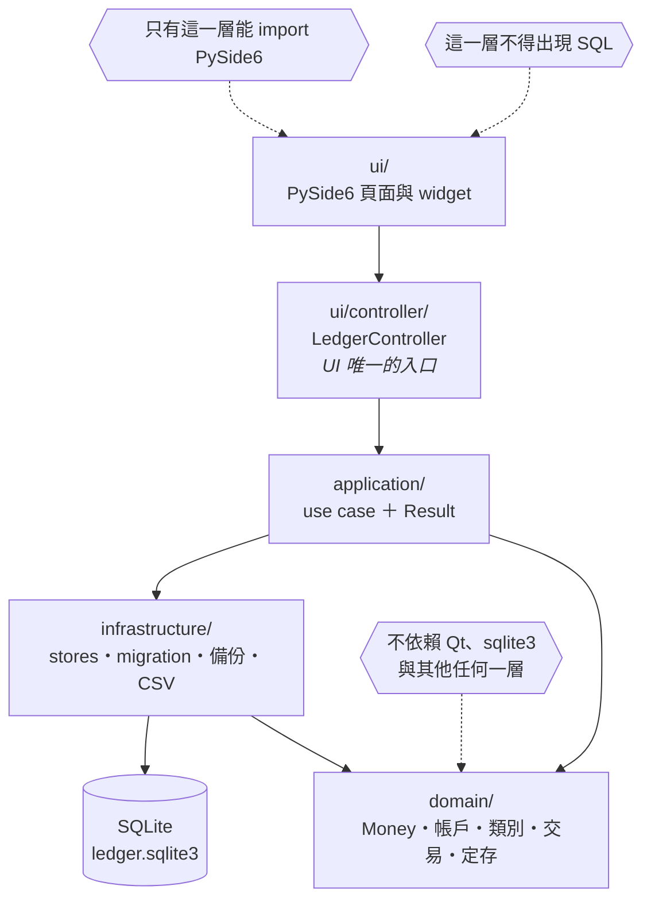
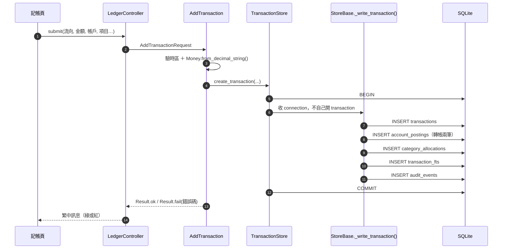

# Architecture Overview

**本檔的權威範圍：** 分層邊界、每一層放什麼、依賴方向，以及守著這些邊界的測試。

> **這裡不重述 UI 規格。** 側邊欄、頁面地圖與版面規則在
> [`ui-workflows.md`](ui-workflows.md)，色票與樣式規則在 [`AGENTS.md`](../../AGENTS.md)。
> 這份文件曾經把主題規格抄過來一份，然後那一份放到 v0.12.0 才被發現還寫著「深藍色系」——
> **同一件事有兩個權威，過期的一定是沒人在看的那一份。**



> **圖只是導覽，規則的正本是底下的文字與那張守門測試表。** 三個虛線標註對應
> `tests/unit/test_architecture.py` 裡真的會失敗的三條檢查。

## 分層

- `domain`：純模型、`Money` 與定存的計息規則。**不依賴 Qt、sqlite3，也不依賴其他層。**
- `application`：use case ＋ `Result`。交易、帳戶／類別、模板與定期收支、盤點、定存、
  法規庫、設定、診斷。
- `infrastructure`：schema migration、store、備份／還原／重製、CSV 匯出、時鐘。
- `ui`：PySide6 widgets 與 controller。
- `app`：啟動、路徑、外部系統設定、日誌、單一實例、視窗狀態。

## 檔案在哪裡

```text
src/tagcor_ledger/
├── __main__.py         python -m tagcor_ledger
├── main.py             CLI 參數、--json、單一實例、啟動失敗分類
├── domain/             models、deposits、dates、money
├── application/
│   ├── transaction_service.py  收入／支出／轉帳／編輯／作廢／替換轉帳／列表
│   ├── catalogs.py     帳戶、類別／項目
│   ├── balance.py      餘額盤點與未解釋差額
│   ├── automation.py   模板與定期收支
│   ├── deposits.py     定存：計息、到期、續存
│   ├── reference.py    離線法規庫（唯讀）
│   ├── settings.py     ledger 內的一般偏好
│   ├── diagnostics.py  診斷資訊匯出
│   ├── result.py       Result：成功／失敗與錯誤碼
│   └── failures.py     錯誤碼 → 中文說法。**一個碼的句子只寫在這裡**
├── infrastructure/
│   ├── migrations.py   v1 → v7 的 schema
│   ├── database.py     連線（WAL、FK、busy_timeout）
│   ├── sqlite_store.py 組出 LedgerStore，本身不含 SQL
│   ├── stores/         一個聚合一個檔：accounts／categories／transactions／
│   │                   balance／deposit_contracts／deposit_terms／deposit_events／
│   │                   templates／schedules／occurrences ＋ base（共用）
│   │                   ＋ drafts（模板與定期收支共用的草稿驗證，不是 store）
│   ├── maintenance.py  備份、驗證、還原、重製、CSV 匯出
│   └── clock.py        台北時區的「今天」
├── ui/
│   ├── navigation.py   PageId、側邊欄順序、顯示文字（改 LABELS 不影響任何查表）
│   ├── controller/     LedgerController：UI 唯一的入口。用繼承把 wiring／ledger／
│   │                   automation／deposits／balance／maintenance／data_paths／
│   │                   overview 幾段組起來，`__init__.py` 只放組裝不放方法
│   ├── formatting/     dict → 顯示字串（唯一決定畫面中文長相的地方）。
│   │                   primitives（金額／日期／名稱表）、rows（每一列）、messages
│   ├── main_window.py  側邊欄、頁面堆疊，以及頁面之間所有的連動
│   ├── theme.py        apply_dark_theme：Fusion style、字體、palette、QSS
│   ├── colors.py       色票的正本
│   ├── pages/          一個檔案一個畫面
│   └── widgets/        sidebar、layout、table、forms、filters、
│                       simple_form、draft_dialog、reorder_dialog、sort_editor
└── app/                bootstrap、paths、path_settings、window_state、
                        logging_setup、single_instance、startup、resources
```

### 交易只有一個寫入點

**`LedgerStore` 用繼承把 `stores/` 底下十個聚合組起來，不是委派。**
理由寫在 `sqlite_store.py` 的 module docstring：這些 store 共用同一份 `AppPaths` 與
同一套「每次呼叫自己開連線」的模型，對外一直是單一物件；用繼承組裝時拆檔只是
「這個 `def` 放在哪個檔案」，換成委派要手寫幾十個轉發方法。

**`LedgerController` 用的是同一套論證。** 2026-08-22 它從單一的 700 行 `controller.py`
（剛好貼著上限）拆成 `ui/controller/` 套件，呼叫端一個字都不用改 ——
`from tagcor_ledger.ui.controller import LedgerController` 現在解析到套件的 `__init__`。
section 之間**彼此不呼叫對方**，唯一的例外是 `OverviewSection`：資產總覽這一頁的內容
就是「帳戶 ＋ 定存 ＋ 待確認 ＋ 盤點差額」湊起來的，所以它明說自己是聚合層並繼承那幾段。

**「一筆交易長什麼樣」的知識集中在 `StoreBase._write_transaction()` /
`_write_transfer()`。** 它們寫 transactions 一列、posting（轉帳兩列）、allocation、
FTS 索引與稽核列，然後就結束 —— **收 `connection`，不自己開 transaction。**

那個簽章是重點。有兩種呼叫情境：

| 情境 | 誰 | 為什麼 |
|---|---|---|
| 「就寫這一筆」 | `TransactionStore.create_transaction()` | 自己開一個 transaction 包住寫入器 |
| 「建交易 ＋ 改別的表的狀態」 | `OccurrenceStore.confirm_occurrence()` | 兩件事必須同一個 transaction，否則會出現「狀態是 confirmed 但交易沒建出來」 |

2026-08-21 之前 `AutomationStore`（2026-08-22 拆成 templates／schedules／occurrences
三個）站在 `stores/` 外面，也**自己重寫了一份寫入路徑**
（約 70 行），原因就是舊的 `create_transaction()` 會自己開 transaction、塞不進外層。
代價不是重複而是**分岔**：兩份 `_refresh_fts` 的 SQL 一字不差，只有一份會先 `DELETE`；
兩份 `_audit` 只有一份收 `correlation_id`。詳情見 [失敗紀錄](../lessons.md)。

現在 `transactions`、`transaction_fts`、`audit_events` **各只有一個寫入點**，
由 `test_only_one_module_writes_a_transaction` 守著（`migrations.py` 除外 ——
它重建索引是 schema 演進，不是執行期的寫入路徑）。



**`_write_transaction()` 收 `connection` 而不是自己開**，所以「確認待確認項目」
那條路徑（要在同一個 transaction 裡改 occurrence 狀態）用的是同一份實作。

## 頁面之間怎麼連動

`ui/pages/` 底下的頁面**彼此不 import**：要互動就往上發 Qt Signal，由 `main_window.py`
接起來。所以「按了 A 會影響 B」只會出現在一個檔案裡。

`ui/navigation.py` 的 `PageId` 是頁面的身分，顯示文字在 `LABELS`。
**不得拿顯示文字當查表的 key** —— 舊版是 `show_page("快速記帳")`，改一個字就是
執行時的 `KeyError`，而型別檢查看不出來。有測試守著。

## 這些邊界由測試守著，不只是文件

`tests/unit/test_architecture.py` 用 AST 檢查，違反會讓測試失敗：

| 檢查 | 規則 |
|---|---|
| `test_extractors_work_on_a_known_module` | **陽性對照**：抽取器抽不到東西的話，底下每一條都會空過 |
| `test_domain_depends_on_nothing_but_itself` | domain 不得 import Qt、sqlite3 或任何其他層 |
| `test_only_the_ui_layer_knows_about_qt` | 只有 `ui/` 可以 import PySide6 |
| `test_nothing_below_the_ui_imports_the_ui` | 依賴方向只能由外往內 |
| `test_ui_layer_contains_no_sql` | `ui/` 的字串常數不得出現 SQL |
| `test_only_one_module_writes_a_transaction` | 交易、FTS 索引與稽核列各只有一個寫入點 |
| `test_every_store_lives_in_the_stores_package` | store 一律放在 `infrastructure/stores/` |
| `test_the_store_package_reexports_exactly_what_ledger_store_composes` | `stores/__init__.py` 的 `__all__` 與 `LedgerStore` 的基底一致 |
| `test_the_controller_assembly_file_holds_no_logic` | `ui/controller/__init__.py` 不得定義任何方法 |
| `test_every_controller_method_lives_in_a_section_module` | controller 的方法都住在 `ui/controller/` 底下 |
| `test_no_page_builds_its_own_table_row` | 「一列長什麼樣」只由 `ui/formatting/` 決定 |
| `test_no_module_grows_back_into_a_monolith` | 單一模組不得超過 700 行 |
| `test_extractor_separates_documentation_from_values` | **陽性對照**：純字串陳述算文件、不算值 |
| `test_ui_does_not_use_retired_wording` | `ui/` 的字串常數不得出現已淘汰的 UI 用詞 |

700 行那條是**煙霧偵測器不是規矩**：2026-08 拆檔前 `main_window_phase12.py` 長到
2,114 行、`sqlite_store.py` 長到 1,381 行，都是沒人注意就長大的。

另外兩條在別的檔案裡，但守的是同一類東西：
`tests/unit/test_docs_drift.py`（頁面名稱與文件逐字一致）、
`tests/integration/test_query_plans.py`（熱查詢不得退化成全表掃描）。

## 資料流

UI 不直接操作 SQL。所有 UI 操作透過 controller 呼叫 application service；
service 回傳 `Result`，UI 把錯誤顯示成繁體中文訊息。錯誤碼的正本是
[`error-codes.md`](error-codes.md)。

## 幾條跨層的邊界

- **系統路徑設定在 SQLite 外部** —— 資料庫路徑本身不能可靠地存放在資料庫內。
  細節見 [`storage-layout.md`](storage-layout.md)。
- **視窗大小與位置也在 SQLite 外部**（`config_dir/window.json`）。那是 UI 狀態不是
  帳務資料，不值得為它付一次 migration 的代價，也不該進備份與還原的語意。
- **payee 已移除**：「項目」描述具體收支，「備註」補充說明。
- **備份只由明確的手動操作觸發**，沒有背景程序也沒有 Windows 工作排程。
- **App 永遠不發網路請求。** 法規庫是專案裡的靜態資料，抓取工具在 `tools/law_sync/`，
  由人手動執行。有測試掃 `src/` 確認不依賴任何網路函式庫。
