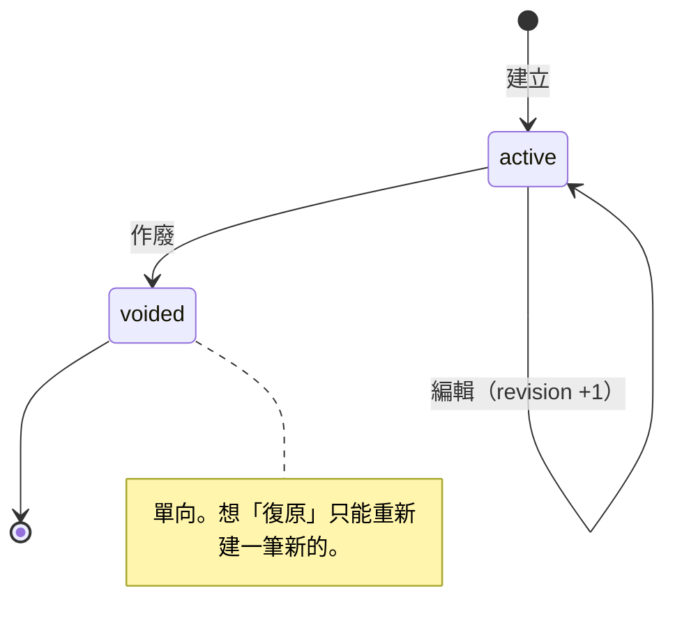
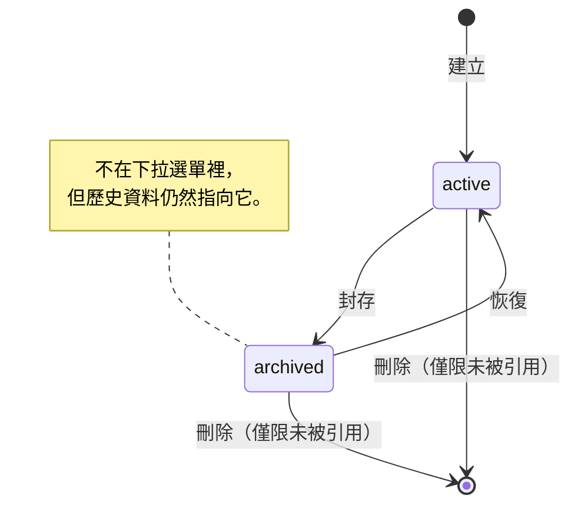
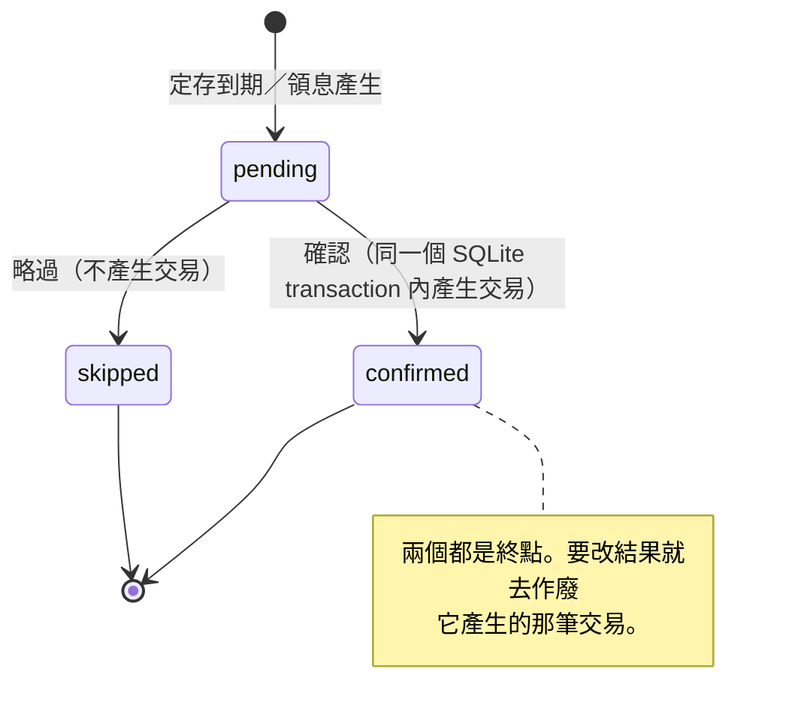
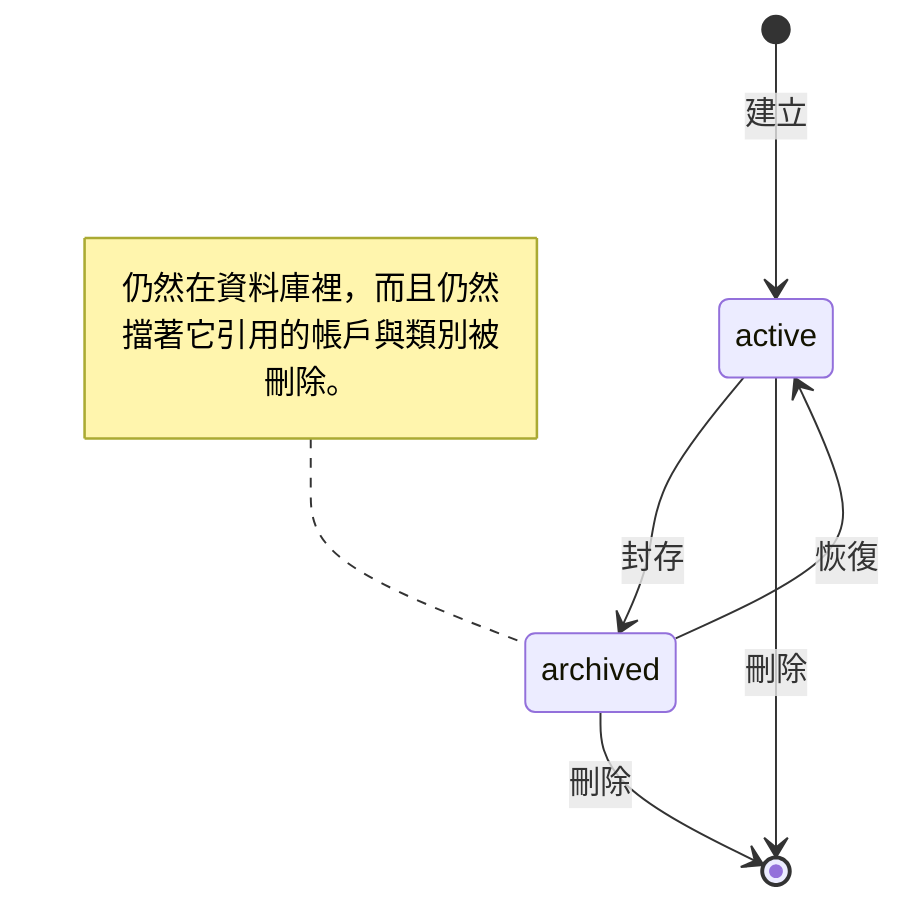
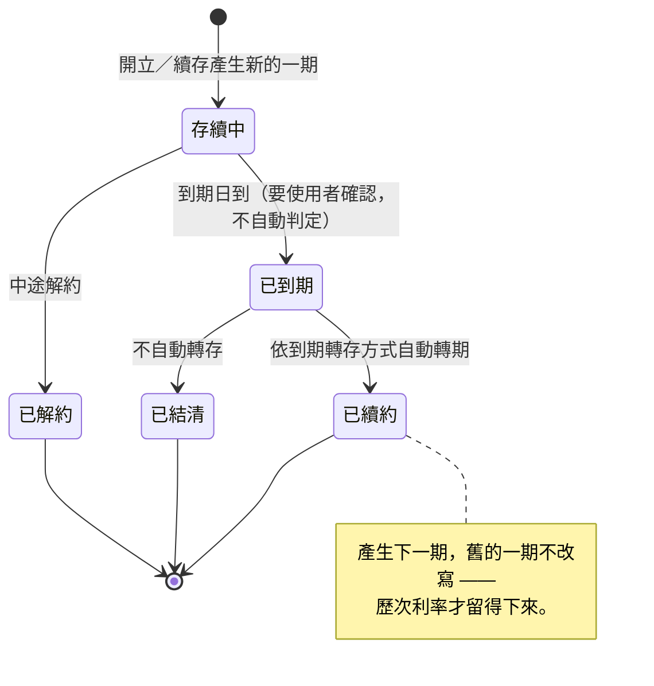

# 狀態機

**本檔的權威範圍：** 所有帶狀態的實體，它們的合法轉移，以及**刻意不做的推論**。
狀態值本身以 `infrastructure/migrations.py` 的 `CHECK` 約束為準，本檔若與程式不符，以程式為準並回頭修本檔。

寫法沿用 `D:\Projects\_meta\CONVENTIONS.md` §5：**先列狀態與定義，再列完整轉移表，最後寫「這裡不做什麼推論」。**
每個狀態機都要能回答「從 A 能不能到 B」，不能只畫箭頭。

---

## 1. 交易 `transactions`

`CHECK (status IN ('active', 'voided'))`，另有 `revision` 整數欄位。

| 狀態 | 定義 |
|---|---|
| `active` 有效 | 計入餘額與所有統計 |
| `voided` 作廢 | 不計入任何計算，但**保留紀錄**。不是刪除 |

### 轉移表

| 從 ＼ 到 | `active` | `voided` |
|---|---|---|
| **`active`** | ▶ 編輯（`revision` +1） | ▶ 作廢 |
| **`voided`** | ✗ **不可復原** | — |



**作廢是單向的。** 想恢復一筆作廢的交易，只能重新建立一筆新的。這是刻意的 —— 復原會讓
「這筆到底有沒有計入」的歷史變得無法追溯。

### 編輯與 revision

編輯不改狀態，只把 `revision` 加一。`UpdateTransaction` 會比對送進來的 revision 與資料庫現值，
不一致就丟 `TRANSACTION_REVISION_CONFLICT` —— 這是樂觀鎖，防的是同一筆交易被兩個地方同時改。

### 轉帳是例外：不能編輯，只能替換

轉帳牽涉兩筆 posting 與兩個帳戶，就地編輯會讓中間狀態不平。所以：

```
編輯轉帳 → TRANSFER_EDIT_NOT_SUPPORTED
```

正確流程是**替換**：在**同一個 SQLite transaction 內**建立新轉帳、作廢舊轉帳，
新交易的 `replaces_transaction_id` 指向舊的。要嘛兩件事都成功，要嘛都沒發生。

```
舊轉帳 active ──┐
                ├─ 同一個 SQLite transaction ─→ 舊轉帳 voided ＋ 新轉帳 active
新轉帳（建立）──┘                                        └── replaces_transaction_id 指向舊的
```

### `entry_type` 不是狀態

`CHECK (entry_type IN ('income', 'expense', 'transfer', 'adjustment'))`，建立後不變。

> **`adjustment` 目前沒有任何程式碼會建立。** 它從 v1 就在列舉與 CHECK 約束裡，為了「將來的對帳調整」
> 預留，至今（2026-08）空置。**這是本專案「先加著以後再說」的實例，不是待辦事項** ——
> 真的要做對帳調整時再一併設計，不要因為欄位已經在就隨便用它。
>
> **2026-08-22 起這件事有測試守著**：`tests/unit/test_reserved_schema.py` 會擋住「在別的地方
> 開始用 `adjustment`」。那份檔案自己寫著期限 —— [REQ-0010](../requirements/REQ-0010-reconciliation-gap.md)
> 在 2026-10 月底重新評估，判定做或不做都會讓那份守門連同這個欄位一起處理掉。

---

## 2. 帳戶 `accounts` 與 類別／項目 `categories`

兩者的狀態機**完全相同**：`CHECK (status IN ('active', 'archived'))`。

| 狀態 | 定義 |
|---|---|
| `active` 使用中 | 出現在下拉選單，可被新交易引用 |
| `archived` 已封存 | 不出現在下拉選單，但**歷史資料仍然指向它**，報表照常顯示 |
| （不存在） | 已刪除。只有從未被任何歷史資料引用過的才能走到這裡 |

### 轉移表

| 從 ＼ 到 | `active` | `archived` | 刪除 |
|---|---|---|---|
| **`active`** | — | ▶ 封存 | ✂ **僅限未被引用** |
| **`archived`** | ▶ 恢復 | — | ✂ **僅限未被引用** |



### 封存與刪除的分界，是這套設計的核心

**只要被任何一筆歷史資料引用過，就永遠不能刪，只能封存。** 否則報表會出現指向空無的外鍵，
或者更糟 —— 靜默地少算。相關錯誤碼：`ACCOUNT_IN_USE`、`CATEGORY_IN_USE`。

另外三條限制：

- **預設帳戶不能刪**（`ACCOUNT_IS_DEFAULT`）。刪掉之後記帳頁沒有預設值可填。
- **有子項目的類別不能刪**（`CATEGORY_HAS_CHILDREN`），要先處理掉子項目。
- **有使用中子項目的類別不能封存**（`CATEGORY_HAS_ACTIVE_CHILDREN`），否則會出現
  「父類別已封存但子項目還在選單裡」的矛盾。

### 兩層結構

`CHECK (level IN (1, 2))`，且 `(level=1 AND parent_id IS NULL) OR (level=2 AND parent_id IS NOT NULL)`。
第一層叫**類別**，第二層叫**項目**。沒有第三層，也不打算有 —— 理由見 `docs/research/market-scan.md` P1。

---

## 3. 待確認項目：`deposit_events`

**一個來源、一張轉移表。** 使用者看到的是一個收件匣（`controller.list_inbox()`），
今天由定存獨家供應。

> **v0.23.0 之前有兩個來源。** 定期收支的 `scheduled_occurrences` 走的是一模一樣的
> 三個狀態，所以兩者寫在同一節；那個功能移除之後
> （[ADR-0011](../decisions/ADR-0011-drop-recurring-schedules.md)）這一節只剩定存。

`deposit_events` 的狀態欄：`CHECK (status IN ('pending', 'confirmed', 'skipped'))`，
由 `DepositService.generate_due()` 產生。

| 狀態 | 定義 |
|---|---|
| `pending` 待確認 | 定存產生的**草稿**，尚未成為交易。不影響任何餘額 |
| `confirmed` 已確認 | 使用者確認過，**已經產生對應的交易** |
| `skipped` 已略過 | 使用者決定這一期不記。不產生交易，但留下「我看過並決定跳過」的紀錄 |

### 轉移表

| 從 ＼ 到 | `pending` | `confirmed` | `skipped` |
|---|---|---|---|
| **`pending`** | — | ▶ 確認（產生交易） | ▶ 略過 |
| **`confirmed`** | ✗ | — | ✗ |
| **`skipped`** | ✗ | ✗ | — |



`confirmed` 與 `skipped` 都是**終點**。想改變已確認的結果，去作廢它產生的那筆交易；
`DEPOSIT_EVENT_NOT_PENDING` 就是在擋非 `pending` 的修改。

### 確認時只問實際金額

**不開一張可以改帳戶與類別的表單。** 定存事件的帳戶、流向與類別都是合約當初就決定
好的（三種計息方式 × 四種到期轉存方式）；在確認的當下改它們等於改一份已經生效的
合約。唯一會與試算值不同的是**金額**，因為權威值在存摺上。

### 這裡刻意不做的事

- **定存不會自動入帳。** 它只產生 `pending` 項目，一定要由使用者確認。
  這與「每一筆都手動輸入」的核心一致（[ADR-0006](../decisions/ADR-0006-manual-entry-only.md)）。
- **確認與帳務寫入在同一個 SQLite transaction 內。** 不會出現「狀態變成 confirmed
  但交易沒建出來」。
- **沒有「全部確認」。** 建議利息是程式試算的，權威值在存摺上；批次套用試算值等於
  替使用者決定了一個他沒看過的數字。
- **產生是冪等的**：`(term_id, event_type, due_date)` 唯一，而且只看未來 7 天，
  一次做完 —— 所以沒有「一次最多 N 期」那種上限，也不需要「繼續產生」。

---

## 4. 餘額盤點 `balance_snapshots`

`CHECK (status IN ('active', 'voided'))`。

| 狀態 | 定義 |
|---|---|
| `active` 有效 | 作為差額計算的基準點 |
| `voided` 作廢 | 不作為基準點。下一次計算會往前找上一筆有效盤點 |

轉移與交易相同：`active → voided` 單向，不可復原。

### 盤點不是交易

**這是最容易被誤解的一點，也是硬規則：**

> 盤點**不建立交易、不建立 posting、不改變帳戶餘額**。

它只是「我在這個時間點數了一下，實際有這麼多錢」的一張快照。

差額的算法：

```
第一筆盤點前的基準 ＝ 帳戶期初餘額
其後每筆的基準     ＝ 上一筆有效盤點的實際金額
預期金額           ＝ 基準 ＋ 兩次盤點之間所有有效 posting 的加總
未解釋差額         ＝ 本次實際金額 － 預期金額
```

補記、編輯或作廢任何交易之後，差額會**依交易時間重新計算**，不是存下來的固定值。

### 已知缺口：對帳與盤點不是同一件事

盤點只能對**總額**。有存摺的帳戶其實能**逐筆**核對，但目前沒有地方記錄「這一筆我對過存摺了」。

GnuCash 的文件把這兩種帳戶分得很清楚（見 `docs/research/market-scan.md` P3）：

| | 郵局 | 現金 |
|---|---|---|
| 有對帳依據 | 有（存摺明細） | 沒有 |
| 合適的動作 | **逐筆核對** | **定期盤點** |
| 差額的意義 | 記錯或漏記，該查到底 | 忘了記的零星消費，預期之內 |

**目前對兩者一視同仁。對現金是對的，對郵局不夠。**
需求與證據記在 `docs/requirements/REQ-0010-reconciliation-gap.md`，
**刻意不先加欄位** —— 理由見該檔。

---

## 5. 模板 `transaction_templates`

`CHECK (status IN ('active', 'archived'))`，轉移與帳戶／類別相同（`active ↔ archived`）。

> **v0.23.0 之前這一節還包含定期收支**（`recurring_schedules`），兩者的狀態機一模一樣。
> 那個功能整個移除了，理由見
> [ADR-0011](../decisions/ADR-0011-drop-recurring-schedules.md)。

### 轉移表

| 從 ＼ 到 | `active` | `archived` | 刪除 |
|---|---|---|---|
| **`active`** | — | ▶ 封存 | ✂ **永遠可以** |
| **`archived`** | ▶ 恢復 | — | ✂ **永遠可以** |



### 刪除沒有「未使用」這個條件

**整份 schema 裡沒有任何一張表指向 `transaction_templates`**，那是查過的結論不是疏漏。
套用模板產生的是一筆獨立的交易，而那筆交易不記得自己從哪個模板來 —— 所以刪掉模板
動不到任何歷史資料。對照組是帳戶與類別：它們被 posting、盤點與模板引用，
所以刪除前一定要檢查（`ACCOUNT_IN_USE` / `CATEGORY_IN_USE`）。

### 恢復要擋同名

schema 有 `idx_templates_active_name`（`UNIQUE(name) WHERE status = 'active'`），
恢復一個與現有使用中模板同名的會丟 `TEMPLATE_ACTIVE_NAME_CONFLICT`。
少了這一步浮上畫面的會是 SQLite 的英文原文。

### 其他

- **模板的「填入記帳頁」只預填，不直接入帳。**
- **封存的模板仍然擋著它引用的帳戶與類別被刪除。** 這在 v0.22.0 之前是個死結：
  那一頁不列封存的，所以使用者看不到擋路的是什麼（見 [changelog](../changelog.md)）。

---

## 6. 應用程式啟動

不是資料庫裡的狀態，是**啟動流程的結果分支**。列在這裡是因為它決定使用者看到什麼。

| 結果 | 觸發條件 | 使用者應該看到 |
|---|---|---|
| 正常啟動 | 一切就緒 | 主視窗 |
| 設定檔損毀 | `system_paths.json` 不是合法 JSON（`SYSTEM_PATH_SETTINGS_INVALID`） | 繁中對話框：設定檔位置 ＋ 刪掉它會退回預設路徑 |
| 路徑越界 | `ledger_dir`／`backup_dir` 不在 `data_root` 底下（`PATH_OUTSIDE_DATA_ROOT`） | 繁中對話框：三個路徑的實際值 |
| 資料夾不可用 | 磁碟未接、權限不足（`OSError`／`sqlite3.OperationalError`） | 繁中對話框：路徑 ＋ 檢查磁碟是否連接 |
| **schema 太新** | 資料庫版本 > 程式支援版本（`DATABASE_SCHEMA_TOO_NEW`） | 繁中對話框：**不要繼續，去更新程式** |
| 已有實例在跑 | 單一實例守門偵測到 | **把既有視窗叫到最前面**，第二個行程安靜結束（exit 0）。叫不動才退回繁中對話框 |

**六種分支都已實作**（Stage 4，v0.8.0）。分類在 `app/startup.py::classify_startup_error`，
訊息與錯誤碼在 `docs/architecture/error-codes.md` 的「啟動失敗」一節，
驗收在 `tests/integration/test_startup_failures.py`。

> 認不出來的例外會落到 `STARTUP_FAILED`。**那個碼出現就代表這張表漏了一種情形** ——
> 它是待補的訊號，不是正常的終點。

---

## 7. 定存合約與期

**已實作**（Stage 5，v0.9.0）。規格見 `docs/requirements/REQ-0007-time-deposits.md`，
實作在 `domain/deposits.py` 與 `application/deposits.py`。

**期**（`deposit_terms`）的狀態：

| 狀態 | 定義 |
|---|---|
| `存續中` | 尚未到期 |
| `已到期` | 到期日已過，尚未處理 |
| `已續約` | 依到期轉存方式產生了下一期 |
| `已結清` | 本金（與利息）已轉回帳戶，合約結束 |
| `已解約` | 中途解約 |

| 從 ＼ 到 | `存續中` | `已到期` | `已續約` | `已結清` | `已解約` |
|---|---|---|---|---|---|
| **`存續中`** | — | ▶ 到期日到 | ✗ | ✗ | ▶ 中途解約 |
| **`已到期`** | ✗ | — | ▶ 自動轉期 | ▶ 不自動轉存 | ✗ |
| **`已續約`／`已結清`／`已解約`** | ✗ | ✗ | ✗ | ✗ | — |



**與待確認相同的原則：到期不自動入帳。** 到期前 7 天產生待確認項目，由使用者確認才成為交易。
`tests/integration/test_deposits.py::test_generating_events_never_writes_a_posting` 斷言
產生事件之後 `account_postings` 一列都沒有增加。

### 三 × 四效果矩陣

`InterestMethod` 決定**期間內**發生什麼：

| 計息方式 | 期間內每月 |
|---|---|
| 整存整付 `lump_sum` | 無 |
| 存本取息 `monthly_interest` | 收入：利息 → 指定帳戶 |
| 零存整付 `installment_savings` | 轉帳：指定帳戶 → 定存帳戶 |

`MaturityAction` 決定**到期那天**發生什麼：

| 到期轉存方式 | 本金 | 利息 | 這一期變成 |
|---|---|---|---|
| 不自動轉存 `none` | 轉帳：定存 → 指定帳戶 | 收入 → 指定帳戶 | 已結清 |
| 本息自動轉存本人帳戶 `principal_interest_to_account` | 轉帳：定存 → 指定帳戶 | 收入 → 指定帳戶 | 已結清 |
| 本金續存、利息轉存帳戶 `renew_principal_only` | 留在定存（不產生交易） | 收入 → 指定帳戶 | 已續約，下期本金不變 |
| 本息續存 `renew_principal_and_interest` | 留在定存 | 收入 → **定存帳戶** | 已續約，下期本金含息 |

> **前兩種在帳本上的效果完全相同**，差別只在銀行端是否自動處理。這裡誠實寫出來，
> 免得日後有人以為漏實作了什麼而去「修」一個不存在的問題。

**利息記成收入，不是轉帳。** 利息是新產生的錢；只有本金在兩個帳戶之間移動才是轉帳。
把利息記成轉帳會讓總資產憑空不變，看不出自己賺了多少。

### 這裡刻意不做的推論

- **不自動判定「已到期」。** 期的狀態要等使用者確認到期事件才前進 —— 日期到了不代表
  銀行已經處理，也不代表使用者已經去看過存摺。
- **試算利息永遠只是建議值。** 實際入帳金額以存摺為準，使用者可以覆寫，覆寫的值才會
  寫進 `deposit_terms.actual_interest_minor`。
- **續約後的新一期利率留空**，不沿用上一期 —— 續存是照當時的牌告利率，沿用會捏造事實。

---

## 8. 法規條目

規格寫在 `docs/requirements/REQ-0008-reference-db.md`。**兩個獨立的狀態軸，不要混在一起。**

**抓取狀態**（我們對這筆資料做了什麼）：

| 狀態 | 定義 |
|---|---|
| `待抓取` | 在 `sources.yaml` 裡，還沒抓 |
| `已抓取` | 抓下來了，還沒人看過 |
| `已審閱` | 人工確認過內容與條號正確 |
| `需複查` | `reviewed_at` 超過 6 個月 |

**法律狀態**（這條法規本身處於什麼狀態）：`現行` / `修正中` / `已廢止`。

**這裡不做任何推論。** 「需複查」只是依日期算出來的提示，不代表法規真的變了；
程式**不會自動抓取、不會自動改內容、不會自動計算稅額**。
