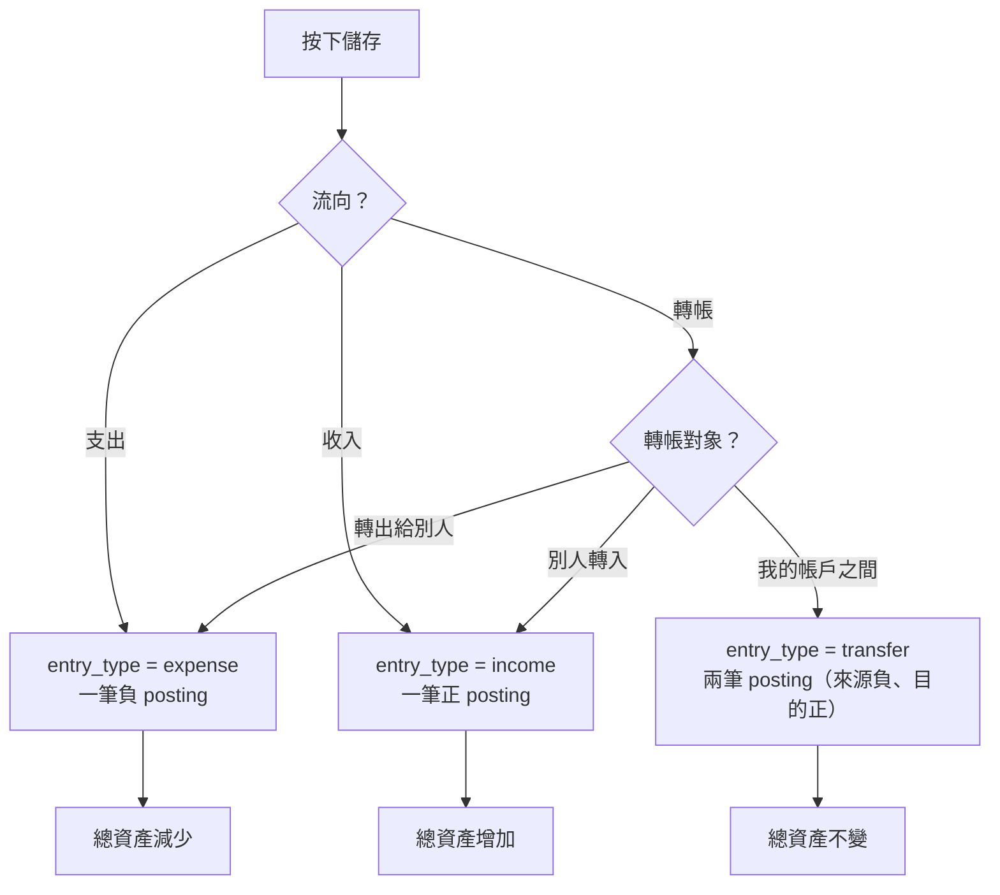
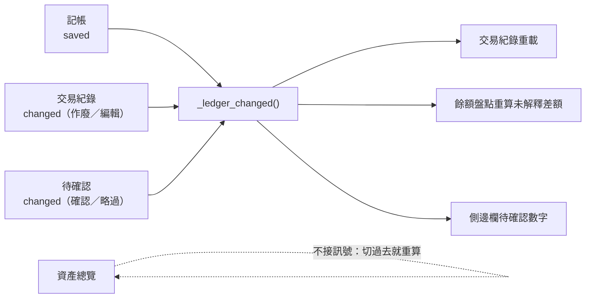

# UI Workflows

**本檔的權威範圍：** 側邊欄順序、每一頁回答什麼問題、各頁的操作流程。

> **側邊欄順序與頁面名稱的程式正本是 [`ui/navigation.py`](../../src/tagcor_ledger/ui/navigation.py)**
> 的 `DAILY_PAGES` / `SETTINGS_PAGES` / `LABELS`。下面的頁面地圖由
> `tests/unit/test_docs_drift.py` **逐字比對**，改了程式而沒改這裡會讓測試變紅。

---

## 頁面地圖

**這張表是這份文件最重要的部分。** 沒有它的時候，連作者自己都會忘記「待確認」是做什麼的
—— 那不是記性問題，是那一頁沒有講出自己是誰。

| 頁面 | 它回答什麼問題 | 什麼時候用 | 不在這裡做的事 |
|---|---|---|---|
| **資產總覽** | 我現在總共有多少錢，還有什麼事沒處理？ | 開啟程式的第一眼 | **不提供任何操作。** 只有兩顆把你送到能處理的地方的按鈕 |
| **記帳** | 我剛剛花了／收了多少？ | 每天，最常用的一頁 | 不處理定期收支與定存到期 —— 那些在待確認 |
| **待確認** | 有哪些草稿等我確認？ | 有徽章數字時 | **不會自己入帳。** 按下確認才變成交易 |
| **交易紀錄** | 過去發生了什麼？ | 要查、要改、要作廢時 | 不能在這裡新增 —— 新增在記帳 |
| **餘額盤點** | 帳本跟實際數出來的錢差多少？ | 想對一下的時候 | **盤點不建立交易。** 差額的處置是補記交易，不是叫程式生一筆調整 |
| **法規參考** | 這件事的法規怎麼規定？ | 需要查條文時 | 不連網。內容是專案裡的靜態資料 |
| **操作設定** | 記帳時會用到的東西怎麼管？ | 要加帳戶、類別、項目、模板、定期收支、定存時 | 不放危險操作 —— 備份、還原、重製在系統設定 |
| **系統設定** | 資料放哪裡、怎麼備份？ | 一年看兩次 | 不放日常偏好以外的東西 |


## 側邊欄

固定順序，由上到下：

**日常**（上半）

1. 資產總覽
2. 記帳
3. 待確認
4. 交易紀錄
5. 餘額盤點

**設定**（沉在最底）

6. 法規參考
7. 操作設定
8. 系統設定

- **側邊欄裡沒有分組標題。** 「日常」「設定」只是程式裡的常數名稱（`DAILY_PAGES`、
  `SETTINGS_PAGES`），畫面上不顯示。分組靠**位置**表達：日常在上、設定貼底，中間是
  會隨視窗長高的留白，中間隔一條 `QFrame#separator`。
  **側邊欄裡的每一個字都可以點** —— `tests/ui/test_main_window.py` 有一條測試守著。
- 這條路用「程度差異」試過兩次都失敗（第一版只是顏色淡一點，第二版縮小加字距），
  兩次使用者的反應都是「這是什麼？為什麼點不動？」。理由寫在
  [失敗紀錄](../lessons.md)與 `ui/navigation.py` 的模組說明。
- **待確認的數量畫在項目右側**，不寫進標籤文字（舊做法是把文字改成「待確認（2）」，
  標籤長度會隨數字跳動）。數字來自 `controller.inbox_count()`，**定期收支與定存一起算**
  —— 側邊欄與資產總覽走同一個來源，不會出現兩個不一樣的數字。
- 視窗寬度 < 1100 px 時側邊欄從 184 縮到 152。**不做圖示折疊模式** —— 專案沒有圖示集。
- **啟動預設停在資產總覽**（`navigation.LANDING_PAGE`）。記帳是「我要做一件事」，
  總覽回答的是「我現在是什麼狀況」；真的要記帳，`Ctrl+N` 一鍵就到。

## 版面規則

**每一類頁面各自的最大寬度，內容置中。** 一個全域上限套全部是錯的：表單再寬只會讓
標籤與欄位隔半個螢幕，但交易紀錄有七欄，寬度是真的有用。

| 頁面 | 最大寬度 | 常數 |
|---|---|---|
| 記帳 | 720 | `FORM_WIDTH` |
| 資產總覽 | 980 | `SUMMARY_WIDTH` |
| 其餘（有資料表的） | 1600 | `TABLE_WIDTH` |

- 行為是 `min(可用寬度, 上限)` 並置中。
- **欄位少的表格收到欄寬總和**（`fit_content`），不然表頭只畫到最後一欄就結束，
  右邊留下一大塊有框線卻沒有表頭的空白。
- **操作設定裡的表格連高度也收到列數**（`fit_rows`，上限 14 列），否則三列資料會變成
  一條又窄又高、幾乎全是空框線的長條。每個分頁最後都要有 `addStretch()`。
- **不寫死視窗最小尺寸**，讓內容決定；`tests/ui/test_layout.py` 守住它裝得進 1024×880。
- 視窗大小與位置記在 `config_dir/window.json`。那是 UI 狀態不是帳務資料，**不進資料庫**。

## 視覺主題

- 介面固定使用深色主題（**中性純灰，零色偏**），不提供主題切換。
- **彩色只留給金額與警示。** 主要操作是近白底深字（靠明度不靠色相）；作廢、刪除、
  重製、還原等高風險操作用紅色。色票正本是 `ui/colors.py`。
- UI 字體：`Microsoft JhengHei UI`、`Microsoft JhengHei`、`Noto Sans TC`、
  `Segoe UI Variable`、`Segoe UI`、sans-serif。**主字體必須是中文字型** ——
  理由見 `AGENTS.md`「UI 樣式規範」。
- 新增 UI 元件時，若用途不同需指定 objectName，避免全域 QSS 影響其他元件。

## 資產總覽

由上到下：總資產大數字 → 各帳戶餘額 → 定存 → 待辦。

- **總資產只加總「使用中」帳戶。** 封存的意思是不出現在選單，**不是錢消失了** ——
  封存帳戶若還有餘額，另外列一行講清楚，否則使用者拿這個數字去對存摺會對不起來。
- 沒有定存合約時，「定存」那一整段不顯示。空的區塊會讓人以為是壞掉或還沒載入。
- 待辦有三種：待確認筆數（＋「去處理」）、今天還沒盤點（＋「去盤點」）、
  最近一次盤點的未解釋差額。差額為 0 時不顯示 —— **「差額 0」不是待辦事項。**
- **切到這一頁就重算**，不靠其他頁發訊號通知。它讀的東西橫跨帳戶、定存、定期收支與
  盤點，要在每個 `_..._changed` 各記一筆的話遲早漏掉一項，而漏掉的症狀是總資產停在
  舊數字 —— 看起來像算錯帳。

## 記帳

支出／收入流程：

```text
流向 → 金額 → 帳戶 → 類別 → 項目 → 日期 → 備註
```

轉帳流程 —— **先選對象，欄位跟著換**：

```text
流向 → 轉帳對象 → 金額 → 帳戶 → （轉入帳戶｜類別 → 項目）→ 日期 → 備註
```

| 轉帳對象 | 「帳戶」叫什麼 | 還要填 | 存成 |
|---|---|---|---|
| 我的帳戶之間 | 轉出帳戶 | 轉入帳戶 | `transfer` |
| 別人轉入 | 收款帳戶 | 類別／項目 | **收入** |
| 轉出給別人 | 付款帳戶 | 類別／項目 | **支出** |

- **流向用三顆分段按鈕，不是下拉選單。** 選項永遠只有三個。
  轉帳對象也是分段按鈕，只在流向＝轉帳時出現。
- **金額是主角**：字級與高度都比其他欄位大一階，`Ctrl+N` 直接聚焦到它。
- 用不到的欄位**整列**收起來（含標籤）。「帳戶」那一列的標籤隨對象改字 ——
  同一個下拉在三種情境下問的是不同的問題。
- **對外轉帳存成收入／支出，不是 `transfer`。** 判準是總資產有沒有變；
  理由與被否決的替代方案見 [ADR-0010](../decisions/ADR-0010-external-transfers.md)。
- 內部轉帳的**轉入帳戶預設會避開來源帳戶** —— 兩個下拉停在同一個帳戶時按儲存必定失敗。
- 成功與失敗共用一個訊息位置，但顏色不同（綠／紅）。



> **判準是總資產有沒有變。** 這張圖是 [ADR-0010](../decisions/ADR-0010-external-transfers.md)
> 的一句話版本；為什麼不新增 `entry_type` 寫在那裡。

## 頁面之間怎麼連動

**所有跨頁規則都寫在 `ui/main_window.py`。** 每一頁只管自己，做完事情就發訊號。



**三個會改動帳務的來源接同一個方法，不是三個「差不多」的方法。** 那份清單就是
下一個會漏的地方 —— 2026-08-21 之前交易紀錄根本沒有對外發訊號，於是作廢一筆帳
之後餘額盤點的差額停在舊值（見 [失敗紀錄](../lessons.md)）。

**資產總覽刻意不在這條線上**，它走「切過去就重算」；理由見 `overview.py` 的模組說明。

## 待確認

**一張表、三顆按鈕。** 欄位：到期日／來源／名稱／類型／金額（TWD）／狀態說明。

- **「來源」欄不能省。** 兩種來源的「類型」講的是不同的事 —— 定期收支是收入／支出／
  轉帳，定存是到期／領息／存入 —— 沒有這一欄就看不懂那一欄在說什麼。
- **確認入帳**依來源分派：定期收支開對話框（可先改帳戶、類別、金額、備註），
  定存只問**實際金額**（以存摺為準，建議值只是試算）。
- **略過**同樣依來源分派。
- **全部確認只處理定期收支**，訊息會講清楚還剩幾件定存要逐一確認。理由見
  [state-machines §3](state-machines.md)。
- 顯示失效原因，例如帳戶已封存、類別已封存、尚未填寫金額。
- **「產生到期項目」不常駐在按鈕列。** 啟動時本來就會產生一次，平常按它什麼都不會發生
  —— 一顆按了沒反應的按鈕比沒有按鈕更糟。只有真的還有漏期時才浮出一行提示與一顆行內按鈕。
- **空的時候整組操作收起來，換成一段說明**：定期收支與定存到期會在這裡產生草稿，
  確認之後才會變成交易，程式不會自己記帳；要新增定期收支去「操作設定 → 定期收支」。
  空表格加三顆停用的按鈕說不出任何事情。

## 交易紀錄

- 支援文字、日期區間、帳戶、類別與狀態篩選；上一頁／下一頁用 keyset pagination。
- 支出與收入可直接編輯。
- **轉帳用替換流程**：新轉帳建立成功後，舊轉帳在同一個資料庫 transaction 作廢。
- 「複製到記帳」只預填記帳頁，**不直接入帳**。

## 餘額盤點

- 可選帳戶、日期、目前金額與備註。
- 顯示最近盤點、預期金額、實際金額與未解釋差額。
- 顯示差額期間內的交易，方便補記或檢查。
- **盤點不建立交易。** 差額不為零時的處置是補記交易，不是叫程式生一筆調整。

## 操作設定

六個分頁，**順序本身就是分組**：前四個是記帳會用到的名冊，後兩個是會自己到期的東西。

| 分頁 | 內容 |
|---|---|
| **帳戶** | 帳戶／目前餘額／狀態。新增、重新命名、封存、恢復、刪除未使用，「排序…」調自訂順序 |
| **類別** | 類別／項目數／狀態。**每一個類別都有自己的一列，不管它有沒有子項目**。上方有搜尋與狀態篩選，點表頭可排序，「排序…」調自訂順序 |
| **項目** | 所屬類別／項目／狀態。上方有搜尋、所屬類別與狀態篩選，點表頭可排序，「排序…」調自訂順序（**兩欄：左邊排類別、右邊排它底下的項目**）|
| **模板** | 常用組合。**套用只預填記帳頁，不直接入帳**。「排序…」調自訂順序 |
| **定期收支** | 訂閱、房租這種會自己到期的項目。到期只產生待確認 |
| **定存** | 合約與每一期。到期與領息只產生待確認 |

- **「類別」與「項目」分開**是因為要做的事不一樣：類別十來個、很少動；項目幾十個、
  每個月都在加。合在一頁時兩邊都做不好 —— 舊版就是這樣漏掉「有子項目的類別沒有自己
  的列」，導致類別改不了名。
- **定期收支與定存不合併。** 一個是「每 N 個月重複同一筆」，一個是「一期一期滾、有
  利率與到期轉存方式」，合併會做出一個裝兩種表單的分頁。
- 刪除只適用未被引用的設定項；被歷史資料引用時顯示繁中錯誤並建議封存。
- **「類別」與「項目」的篩選與排序全部在 SQL 裡做**（`CategoryTreeFilter`），
  不是撈回來再用 Python 濾。排序也不用 `setSortingEnabled(True)` —— 那會讓
  `QTableView` 自己在 Python 裡排。表頭只負責「可點 ＋ 顯示箭頭」，真正的排序是
  把 `sort_key` 送回 SQL 再查一次，而 `sort_key` 只能是白名單裡的值。
- **自訂順序在獨立的「排序…」視窗裡調，不在主表格上。** 四頁（帳戶／類別／項目／模板）
  都有那顆按鈕，那份順序也是這些清單的預設順序。
  - **為什麼不放在主表格上**：v0.17.0 曾經在表格上放「上移／下移」，代價是**依欄位
    排序時必須停用它們** —— 畫面上那一列的鄰居不是儲存順序裡的鄰居，「上移」沒有
    可以解釋的結果。使用者點一次表頭就看到按鈕灰掉，而原因看不出來。
    搬進視窗之後衝突消失：**那個視窗永遠顯示自訂順序**，主表格愛怎麼排就怎麼排。
  - **視窗裡可以拖曳**，因為那是 `QListWidget` ＋ `InternalMove`（可寫入的 model）。
    主表格不行 —— 它是唯讀 model ＋ 在 SQL 裡排序，那是 `AGENTS.md` 的硬規則。
  - 同時提供**上移／下移按鈕**：只有拖曳的話，鍵盤操作沒有路可走。
  - **按「確定」才寫入**，取消要真的什麼都沒發生。
  - **封存的也列出來並標「已封存」** —— 藏起來的話它的順序值會停在舊的，
    日後恢復就出現在莫名其妙的位置。
  - **項目的視窗是兩欄**：左邊排類別、右邊排所選類別底下的項目。`sort_order` 的意義
    只在同一組之內，項目跨類別比它沒有意義（每組都是 10、20、30，會互相穿插），
    所以一份平的清單表達不了它。
  - **同一份順序也用在記帳頁的下拉** —— 名冊排好了但下拉沒跟著，等於沒排。
    帳戶的順序另外也決定資產總覽的列法。
- **狀態預設是「全部」。** 名冊分頁是管理用的，看不到封存的東西就沒辦法恢復它。
- **新增與重新命名都是一張表單、按一次確定。** 以前是兩個連續的 `QInputDialog`
  （先問名稱、再問期初餘額／先選類別、再打項目名），取消第二個會把第一個輸入的
  東西靜靜丟掉。

## 系統設定

- **一般設定**：預設帳戶、預設流向、每頁筆數、餘額盤點提醒。
- **資料路徑**：記帳資料路徑與備份路徑，提供切換既有資料與搬移目前資料；
  也顯示目前資料庫的完整路徑（唯讀，可選取複製）。
- **備份與還原**：建立備份、驗證、還原、**刪除**、選擇外部備份資料夾、CSV 匯出、
  匯出診斷資訊。驗證／還原／刪除三顆都綁選取狀態，沒選就停用。
  **刪除不檢查備份有沒有效** —— 壞掉的那一份正是最需要清掉的。確認框會念出這一份
  是什麼，以及刪掉之後還剩幾份可用的備份；剩零份時明講，但**不擋**。
  只肯刪備份資料夾底下的東西，外部資料夾的備份請自己在檔案總管處理。
  清單一列是**時間｜狀態｜資料夾名**，完整路徑放 tooltip 與刪除確認框 ——
  上百字元的絕對路徑放進列裡會撐出橫向捲軸，而每一列前面那一大段還完全相同。
- **重製**：重製目前記帳資料，**不刪除備份資料夾**。

備份只由使用者手動按鈕觸發。還原／重製前保護備份必須勾選才執行。

## 狀態列

**只放暫時訊息。** 資料庫路徑曾經常駐在這裡吃掉一整行，而那是一年看兩次的東西 ——
現在住在「系統設定 → 資料路徑」。盤點提醒也從這裡搬到資產總覽：一則 10 秒就消失的
訊息，去泡杯茶回來就看不到了，等於沒有提醒。
